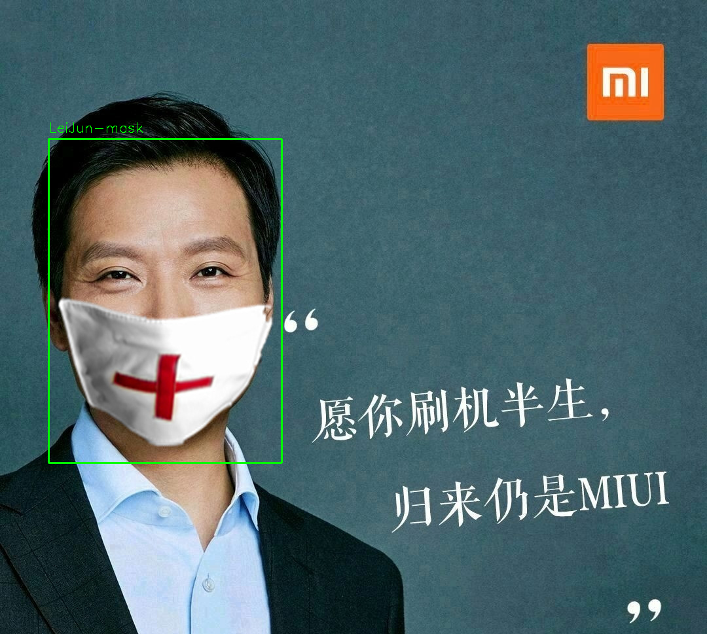
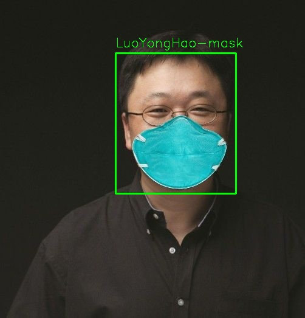

# 简介

利用mtcnn、mobilenet和facenet进行口罩人脸的检测与识别，我只是对已有的开源项目进行了拼接调试。

facenet地址: https://github.com/davidsandberg/facenet

MTCNN和mobilenet地址: https://github.com/bubbliiiing/mask-recognize

给人脸加口罩(参考加口罩部分): https://github.com/Prodesire/face-mask

人脸关键点检测: https://github.com/610265158/Peppa_Pig_Face_Engine

# 思路

我太懒了，去这里看吧！

https://www.notion.so/87bf2f0f4a2e4abdb46647c2c222a944

# 环境

+ tensorflow-gpu = 1.13.1
+ python = 3.5
+ 其余需要什么装什么

# 使用

下载预训练好的模型（自己训练的，切换到**release**下载）放到`models`文件夹下面

1. real_time.py 调用摄像头实时检测和识别
2. local_img.py 识别传入的本地图片

# 效果

# 交流

使用有问题，欢迎交流`1922077535@qq.com`

